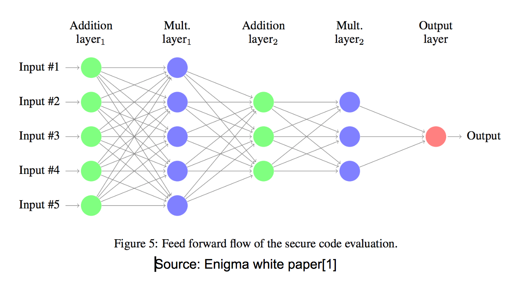
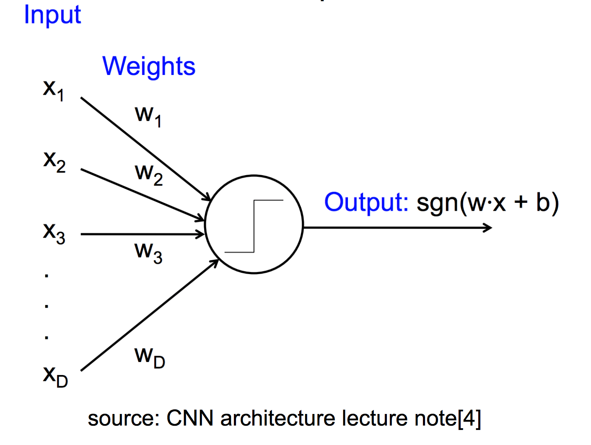
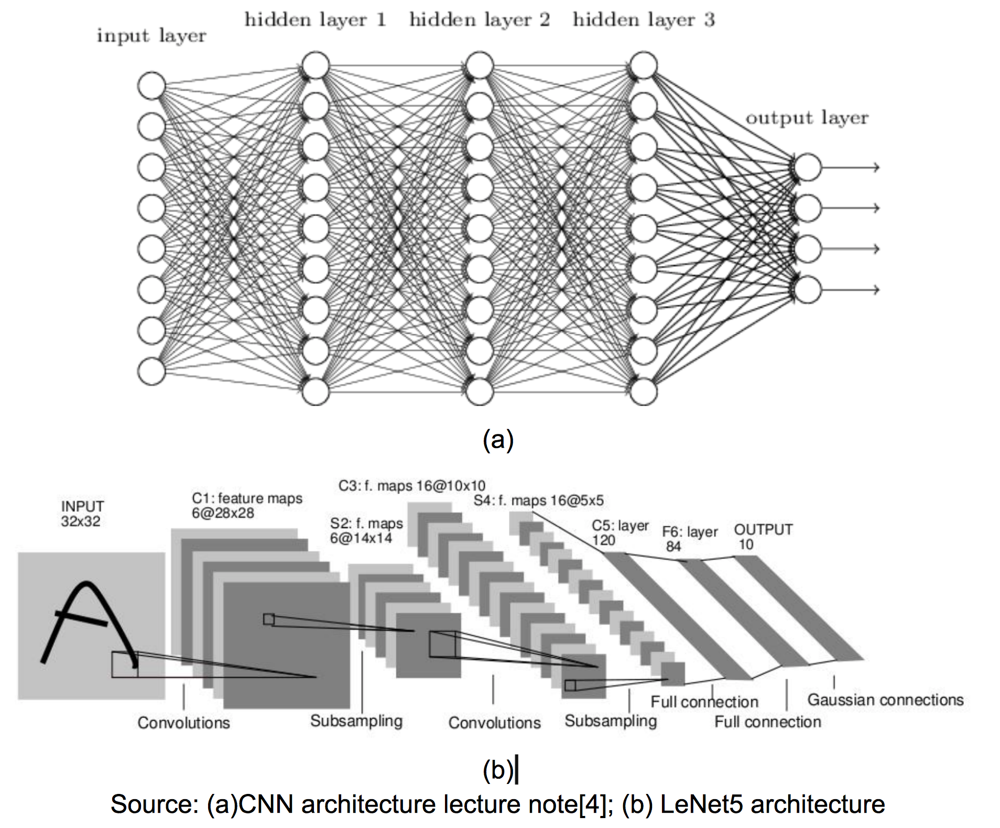

# Study of Enigma and Potential Integration


```
name: investigate Enigma and potential integration
type: research
status: initial draft
editor: Ocean Protocol Team
date: 04/15/2018
```

## 1. Objective
Private computing is essential to decentralized data marketplace projects, because it enables secure computation on data without revealing private raw data. 

Enigma is one of the existing solutions in the private computing field. This study aims to understand the technical framework behind Enigma and explore the feasibility to integrate Enigma with Ocean Protocol. 

## 2. Enigma Framework

### 2.1 Overview
Existing blockchains such as Bitcoin and Ethereum networks are plagued by two issues: *Privacy* and *Scalability*. Enigma tries to solve them: 

* **Privacy**: Enigma uses secure multi-party computation (MPC) to evaluate functions on data without revealing the private data.
	* data is split among different nodes, and each node has only a piece of meaningless data; 
	* each node evaluate function on its local piece of data, so it will not leak its data to other nodes.
	* merge intermediate results from different nodes so that to compute final result of function in a distributed way.

* **Scalability**: 
	* Enigma will **not** replicate computation and storage to every node in network;
	* Enigma off-load the storage and computation to off-chain network;
	* only small subset of nodes are randomly selected to perform computation over their local pieces of data.

### 2.2 Architecture
Enigma system consists of three critical components: *storage*, *computing*, and *blockchain*. 

* **Storage**: 
	* a decentralized off-chain distributed hash-table holding *secret-shared data*;
	* secret-shared data means data is split across nodes and a subset of nodes in the network can securely reconstruct the original data;
	* any single node cannot reveal the entire raw data;

* **Blockchain**:
	* the blockchain only stores references or pointers to the data in storage rather than data themselves;
	* it executes public parts of “private contracts” (i.e., smart contracts that can handle private information);
	* manage the access control, identities, and serves as tamper-proof log of events.

* **Privacy-enforcing Computation**:
	* private contracts are partitioned into two parts: on-chain/public and off-chain/private execution;
	* it uses general-purpose MPC interpreter to transform any arithmetic function of off-chain execution into *addition* and *multiplication* as below (a good analogy is the combinational logic circuit that implements complex functions using basic logic gates such as AND, OR, XOR and etc.) 
	<div style="text-align:center"></div> 
	
	* addition and multiplication are basic secure MPC operations, where a *subset* of nodes in network can evaluate the result using their local data based on *secret sharing*. 
	* Enigma makes multiplication operation practical by reducing *communication-complexity* from quadratic to linear at the cost of increased computation complexity.

## 3. Feasibility of Integration
Enigma framework is suitable to develop data marketplace with *limited computational demand* (e.g., data exchange, statistical evaluation and etc.). To integrate with Ocean Protocol, it might be possible if several issues can be resolved:

* **It needs smart-contract implementation of AI algorithms**: 
	* Enigma reorganizes the private contract (i.e., smart contract handling private information) to run the private computation (addition and multiplication operations) in off-chain network. 
	* in order to run AI algorithm on Enigma, it may demand "private-contract-type implementation" of Tensorflow or other AI frameworks.

* **It is difficult to reorganize AI algorithms**: 
	* General-purpose MPC needs to reorganize complicated private computation into combination of addition and multiplication operations. 
	* AI algorithm is usually much more complicated to be interpreted.

* **Backward Propagation in AI (gradient calculation) is difficult with MPC**:
	* Enigma reorganizes the original functions into addition and multiplication operations at sequential layers as shown in the below, which is similar to forward propagation in deep learning with convolutional neural network.
	<div style="text-align:center"></div>

	Consider the simple neural network with several input units and one output unit: 
	<div style="text-align:center"></div>

	The forward propagation starts from inputs and pass through the network with addition and multiplication to generate single output. This process can be implemented using secure MPC in Enigma, if not impossible. 

	* The more difficult step is *backward propagation*, which calculate the derivative of output w.r.t. the input at each layer except for the output layer. This derivative values measure how the output change corresponding to the input change, therefore, making it possible to tune the weights in each layer for more accurate output. This operation is difficult be handled by MPC.

* **Communication cost could be very high in AI computation**:
	* deep learning usually involves very deep convolutional neural network with up to hundreds of hidden layers. Much worse, each hidden layer may have thousands or even more perceptrons due to larger input size and more complex neural network model. 
	* example of (a) fully-connected neural network and (b) practical LeNet5 neural network architecture are shown in the below to illustrate the complexity of neural network in deep learning.
	<div style="text-align:center"></div>

	* Perceptrons in hidden layers need extremely high communication cost because each perceptron needs the input data from all perceptrons in the previous layer. But all input data spread across different machines and each perceptron needs to communicate with all these machines and collect input data. 

	* pooling, dropout, and activation function between hidden layers require all input data from previous layer which increase the communication cost as well. The computation cannot move forward until all input data become available.


## 4. Reference
* [1] [Enigma white pape](https://s3.amazonaws.com/enigmaco-website/uploads/pdf/enigma_full.pdf)
* [2] [Enigma decentralized storage paper](https://s3.amazonaws.com/enigmaco-website/uploads/pdf/ZNP15.pdf)
* [3] [Intel SGX: Software Guard Extensions](https://en.wikipedia.org/wiki/Software_Guard_Extensions)
* [4] [CNN architecture lecture notes](http://slazebni.cs.illinois.edu/spring17/lec01_cnn_architectures.pdf)
