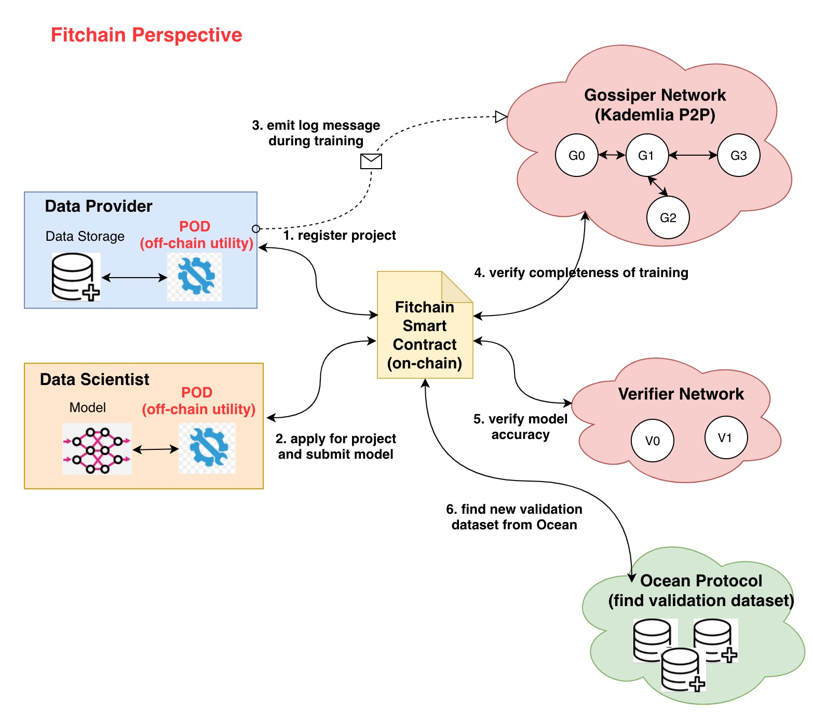
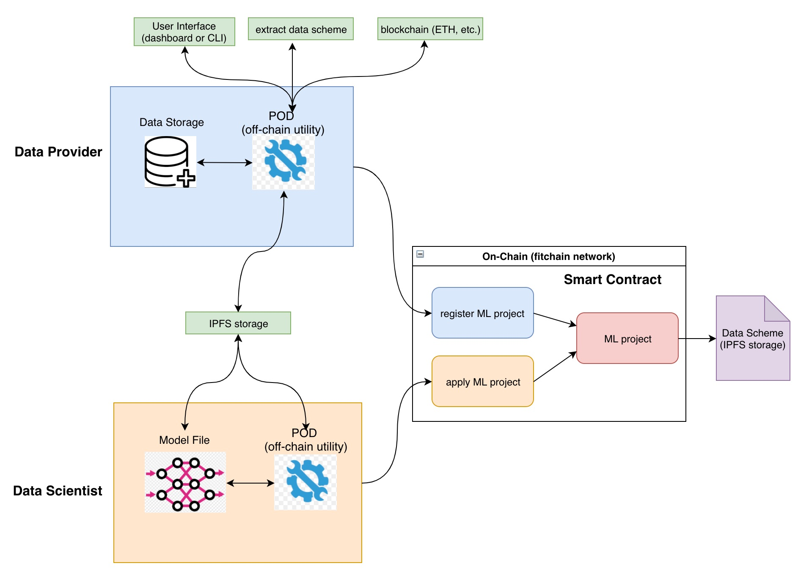
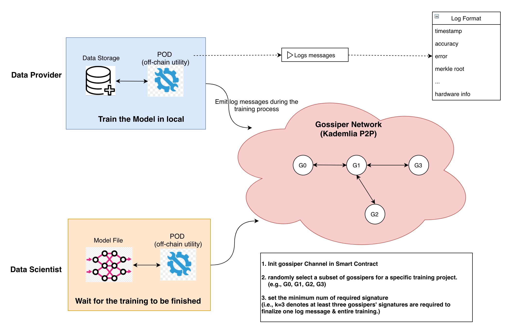
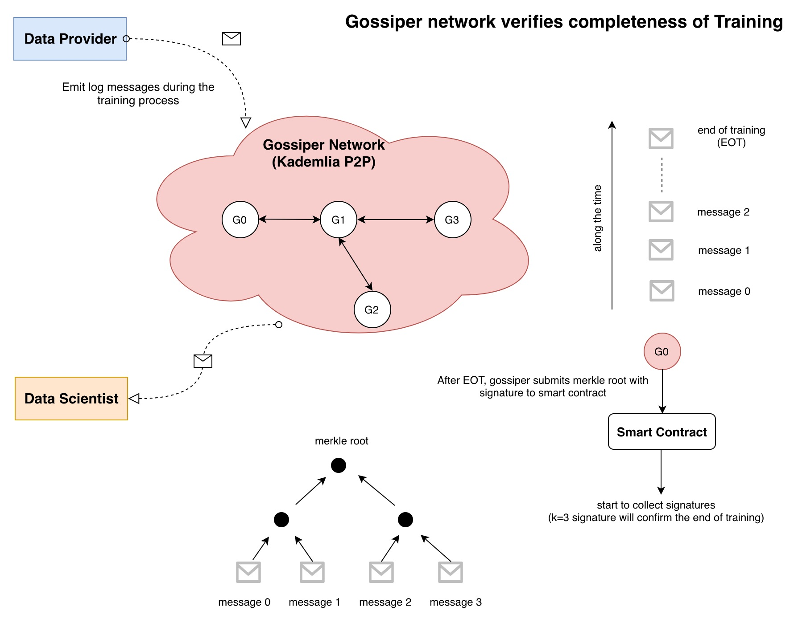
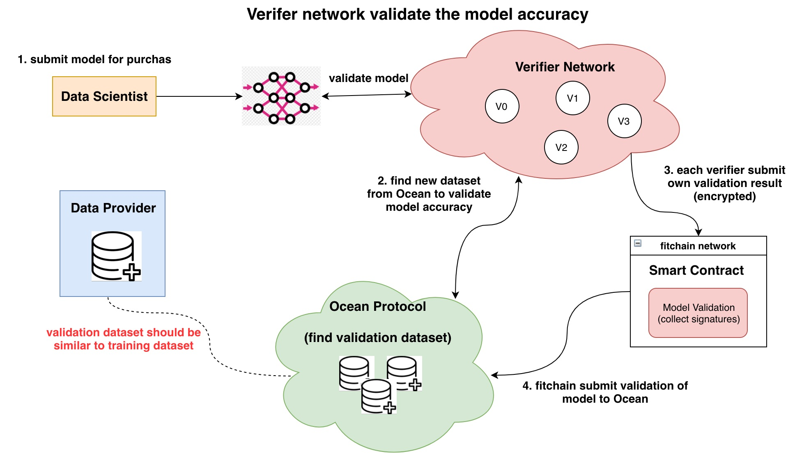
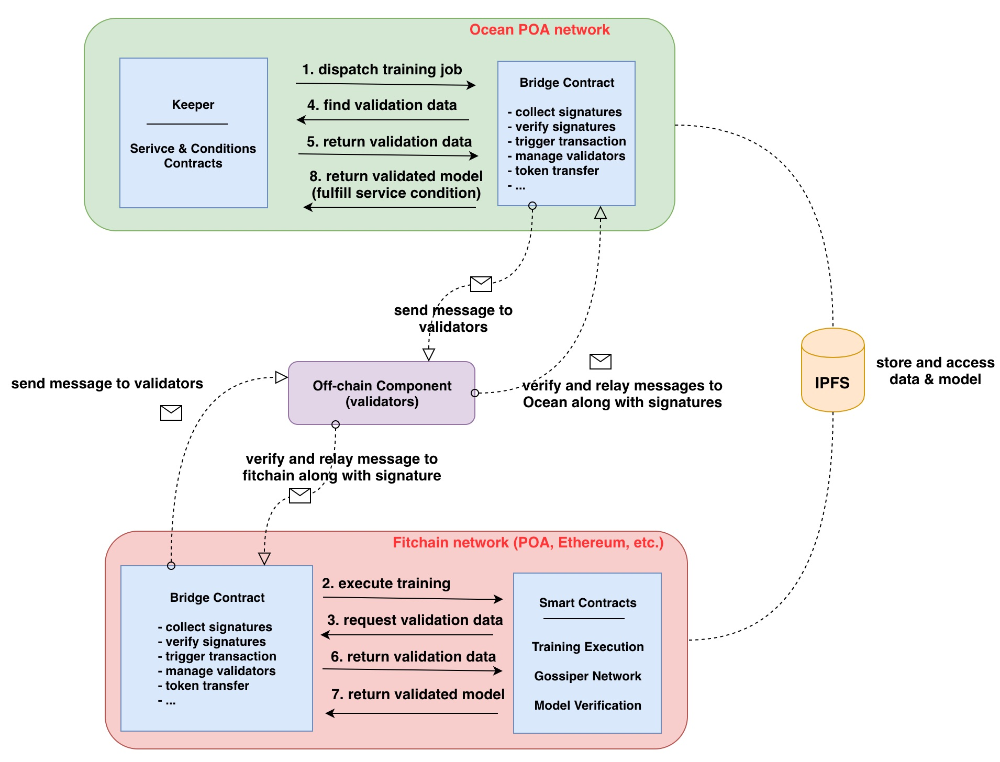

[](https://oceanprotocol.com)

# Fitchain/Ocean Integration Analysis

```
name: repository of fitchain/Ocean integration analysis.
type: research
status: updated draft
editor: Ocean Protocol Team
date: 01/24/2019
```

* [1. Introduction](#1-introduction)
* [2. Folder Structure](#2-folder-structure)
* [3. Fitchain Architecture](#3-fitchain-architecture)
* [4. Deep Dive into Modules](#4-deep-dive-into-modules)
	+ [4.1 POD and Fitchain Smart Contracts](#41-pod-and-fitchain-smart-contracts)
	+ [4.2 Gossiper Network](#42-gossiper-network)
	+ [4.3 Verifier Network](#43-verifier-network)
* [5. Ocean and Fitchain Integration](#5-ocean-and-fitchain-integration)
* [6. Current Implementation Status](#6-current-implementation-status)
	+ [6.1 Ocean fitchain condition](#61-ocean-fitchain-condition)
	+ [6.2 Fitchain contracts](#62-fitchain-contracts)
	+ [6.3 Fitchain gossiper network](#63-fitchain-gossiper-network)
	+ [6.4 Fitchain verifier network](#64-fitchain-verifier-network)
* [7. Investigation](#7-investigation)
	+ [7.1 determine any gaps in Ocean/fitchain integration:](#71-determine-any-gaps-in-ocean-fitchain-integration-)
	+ [7.2 Fitchain Capability:](#72-fitchain-capability-)
	+ [7.3 Gossiper network capability:](#73-gossiper-network-capability-)
* [8. Reference](#8-reference)


## 1. Introduction
This research investigates the following issues of fitchain/Ocean integration:

* evaluate Ocean/fitchain integration to determine any "gaps";
* identify capabilities that fitchain can enable (now vs. future);
* deep dive into fitchain Gossiper network to determine applicability (if any) to Ocean;
* research possible model validation methods post fitchain training.


## 2. Folder Structure

Folder Name  |  Content Description |
--- | --- | 
fitchain-contracts | smart contract of fitchain business logic (on-chain) |
gossiper | implementation of gossiper network in fitchain (off-chain) |
verifier | implementation of verifier network in fitchain (off-chain) |
img | images for README.md document |


## 3. Fitchain Architecture

The overall fitchain architecture is illustrated as below and includes several modules:

* **POD**: the off-chain component that orchestrates communication and data-model access among the actors of the fitchain platform.
* **Fitchain smart contracts**: on-chain smart contract implementation of Fitchain logics.
* **Gossiper network**: the off-chain Kademlia P2P network which replay log messages of model training among gossiper nodes.
* **Verifier netwokr**: the off-chain component where verifier nodes validate model accuracy using the new validation dataset from Ocean.



## 4. Deep Dive into Modules

### 4.1 POD and Fitchain Smart Contracts

* POD is an off-chain component deployed on both Data Provider and Data Scientist sides. It provide interface to all external components including:

	* User interface: dashboard and CLI.
	* Interaction with blockchain & Smart Contract: ethereum, EOS, etc.
	* Storage: IPFS, AWS S3, etc.
	* Data scheme extraction from raw data.
	* ...

* Data provider registers a project in fitchain network (i.e., smart contract) and releases the data scheme in IPFS storage (hash address is published on-chain).

* Data scientist can apply for a project, compose a model based on data scheme in the local, and submit the model to Data Provider for training.



### 4.2 Gossiper Network

* When running the training on the model, **POD** on the data provider side will emit log messages to the Gossiper network as a sequence of messages.

* A `gossiper channel` will be created in smart contract for a specific training project. A subset of gossiper nodes will be randomly chosen and registered in this gossiper channel.

* Each gossiper node that receives an message will broadcast to its neighboring nodes. Therefore, all gossiper nodes will be synced with log messages. 




* Each message will become final after a certain number (i.e., k = 3) of gossipers can confirm it. After all messages become final, the training process proves to be complete.

* Merkle root hash of received messaged will be computed to ensure all gossiper nodes receive the same log messages. In the end, each gossiper needs to submit merkle root hash with own signature to Fitchain smart contract.

* Gossiper network can **verify the completeness of training process** without knowing its accuracy. 





**Concern of Fraudulent Attack:**

(1) Is that possible the gossiper network is susceptible to fraudulent attacks due to malicious gossiper node? 

* one malicious gossiper node may generate fake log messages in its local and broadcast to its neighbors. 
* over the time all nodes in the gossiper network will receive this fake message. 
* once several gossipers confirm this fake log message, it becomes final and attack is successful.   

Suggestion:

* when POD in data provider side emits log messages, it should send signature along with the message.
* each gossiper who receives a new log message should verify the corresponding signature before confirm it. 
* it is better to add this layer of security protection if there is no any.

(2) POD component in data provider side may be compromised and emitted fake log messages. 

Suggestions:

* POD component must be investigated for potential security issues before deployment.

### 4.3 Verifier Network

* Verifier network aims to validate the accuracy of model using new dataset from Ocean.

* The original training data is not accessible to verifiers, therefore, they need to find new dataset which is similar to training data to validate the model accuracy. 

* Each verifier submits own validation result in a commit-reveal process to the Fitchain smart contract. 

* When a certain number (i.e., k = 3) of verifiers can validate the model accuracy, the result becomes final and Fitchain can update the Ocean about model accuracy.




## 5. Ocean and Fitchain Integration

**Assumption**: 

* *Ocean keeper and Fitchain contracts are deployed in different network.* (e.g., Ocean keeper is deployed in Ocean POA network, while Fitchain contracts deployed in Ethereum or its own POA network, etc.).



* **Ocean Keeper**: it should interact with Fitchain network through the Bridge contract including:
	* dispatch training job along with token payment/reward;
	* receive data scheme from Fitchain to search for new validation dataset;
	* store validation data in IPFS and send address hash to Fitchain;
	* receive validated model from Fitchain and fulfill the service condition;
* **Bridge contract**：it should be deployed in both networks to:
	* emit messages to off-chain validators;
	* collect required number of signatures in order to trigger transactions;
	* verify the received signatures from validators;
	* manage the registry of validators (e.g., add, remove, etc.);
	* transfer token payment or reward to Fitchain for the training job.
* **Off-chain Validators**: it can relay the messages across networks:
	* it listens to the event messages emitted from both networks;
	* verify the messages and generate own signature;
	* relay message along with signature to the other network;
	* transfer tokens across the network.
* **Fitchain Smart Contract**: it should launch training and validate models:
	* execute training process in the local of data providers;
	* gossiper network should verify the completeness of training process;
	* should find validation dataset from Ocean to validate the model;
	* verifier network should run validation on the trained model & validation dataset;
	* return the trained model to Ocean through Bridge to fulfill the service condition. 


## 6. Current Implementation Status

### 6.1 Ocean - Keeper Contract:

* [FitchainConditions.sol](https://github.com/oceanprotocol/keeper-contracts/blob/develop/contracts/SEA/FitchainConditions.sol)
	* register as a verifier of model validation (but staking and slashing are not available now)
	* select K verifiers for model validation using round-robin (for load balancing purpose). 
	* change the condition status (i.e., boolean variables) to fulfill the service condition.


### 6.2 Fitchain - Smart Contracts


* setup Gossipers channel for proof of training: [GossipersPool.sol](https://github.com/fitchain/fitchain-contracts/blob/master/contracts/GossipersPool.sol)
* verifiers pool for verification game: [VerifiersPool.sol](https://github.com/fitchain/fitchain-contracts/blob/master/contracts/VerifiersPool.sol)
* commit-reveal scheme for secure voting: [CommitReveal.sol](https://github.com/fitchain/fitchain-contracts/blob/master/contracts/CommitReveal.sol)
* actors registry such as verifiers, gossipers, data owners: [FitchainRegistry.sol](https://github.com/fitchain/fitchain-contracts/blob/master/contracts/FitchainRegistry.sol)
* model registry that manages the model life cycle: [FitchainModel.sol](https://github.com/fitchain/fitchain-contracts/blob/master/contracts/FitchainModel.sol)
* payment functions such as lock, release, refund payment: [FitchainPayment.sol](https://github.com/fitchain/fitchain-contracts/blob/master/contracts/FitchainPayment.sol)
* staking functions such as stake, slash, and release stakes: [FitchainStake.sol](https://github.com/fitchain/fitchain-contracts/blob/master/contracts/FitchainStake.sol)

	

### 6.3 Fitchain gossiper network

* Kademlia P2P network: implement P2P network which can sync up all nodes with transaction messages. [kademlia](https://github.com/fitchain/gossiper/tree/master/kademlia)
* JSON-RPC API module such as handle request, generate response, broadcast transaction, send transaction and etc. [RPC](https://github.com/fitchain/gossiper/tree/master/rpc)
* user account module [account.py](https://github.com/fitchain/gossiper/blob/master/account.py), [create_accounts.py](https://github.com/fitchain/gossiper/blob/master/create_accounts.py)
* encryption and decryption module [ecies.py](https://github.com/fitchain/gossiper/blob/master/ecies.py)
* server module including port settings, bootstrap nodes, etc. [server.py](https://github.com/fitchain/gossiper/blob/master/server.py)
* transaction module which serialize tx data, build tx data, encode /decode values, etc. [transaction.py](https://github.com/fitchain/gossiper/blob/master/transaction.py)


### 6.4 Fitchain verifier network


* user account module: generate account, verify signature, encryption, decryption, etc. [account](https://github.com/fitchain/verifier/tree/master/account)
* interface module: connect to ethereum network with smart contract and IPFS [connector](https://github.com/fitchain/verifier/tree/master/connector)
* verifier access validation data & model and run off-chain validation. [verify.py](https://github.com/fitchain/verifier/blob/master/verify.py)


## 7. Investigation of Issues

### 7.1 determine any gaps in Ocean/fitchain integration:

*  The most important issue is to find validation dataset from Ocean
	*  it remains unknown how to find new validation dataset from Ocean;
	*  it is unclear how Ocean can guarantee the validation data is similar to training data.
*  bridge contract that emits messages and collects signatures is not available.
*  off-chain bridge component relaying Fitchain messages to Ocean is not available.
*  token transfer from Ocean to Fitchain is not available (i.e., service payment, reward).
*  Ocean fitchain condition contract is not complete. Many functionalities need to be added:
	*  dispatch training jobs to Fitchain;
	*  explore validation dataset for a trained model;
	*  return validation data to Fitchain;
	*  verify the validation from Fitchain to fulfill the service condition.
*  Ocean needs utility component to store and access the dataset & model in IPFS.
*  Fitchain needs to add more functionalities in contracts, gossiper network and verifier network as described in the above.
*  POD component of Fitchain should be investigated or audited for potential security compromise. 


### 7.2 Fitchain Capability:

* fufill the computing service conditions where training of models are requested.
* resolve the dispute of trained model accuracy, since verifier network can validate the model accuracy.
* verify completeness of any workflow process with gossiper network in a decentralized manner.

### 7.3 Gossiper network capability:

* verify completeness of off-chain training process in a decentralized manner.
* however, it shall not be used to relay the on-chain messages across blockchain networks.
	* gossiper node needs to verify the signature of the message to prevent fraudulent attacks;
	* on-chain smart contract cannot sign any message to generate signatures.
	* only the externally owned account who owns private key can generate signature.
	* therefore, gossiper node cannot validate the on-chain log messages received from its peers.


## 8. Reference

* [POD off-chain component](https://github.com/fitchain/pod): the off-chain component that orchestrates communication and data-model exchange among the actors of the fitchain platform. (there is no implementation released)
* [Gossiper network](https://github.com/fitchain/gossiper): the off-chain component that verify the completeness of training in a decentralized manner. 
* [Fitchain Smart Contract](https://github.com/fitchain/fitchain-contracts): the on-chain smart contract implementing fitchain business logic.
* [Verifier network](https://github.com/fitchain/verifier): the off-chain component that verify the model correctness/accuracy in a decentralized manner.(the work flow is not complete yet)
* [Ocean fitchain condition](https://github.com/oceanprotocol/keeper-contracts/blob/develop/contracts/SEA/FitchainConditions.sol): the smart contract in Ocean keeper handles the fitchain service condition.

